# Product Demonstration Report

*Our team has managed to design and develop a Financial Profile Manager that lets a user to track and display their investments over a certain period of time, Buy Stocks, Sell stocks, Withdraw and deposit money, see their investment history with a plethora of real-time graphical charts and also in a text form, for example to export their stocks in a PDF.*
*The program also supports multiple users as there is a register and login functionality that users can create their accounts within seconds.*
*Additionally, the user can view information like the dividends or the prices of the stock of a company that the user chose over five years, in a tabular form.*
*The functionality of the program has been dramatically increased since the Minimal Viable Product and we will aim to demonstrate the new components of the system.*

## Home Page:

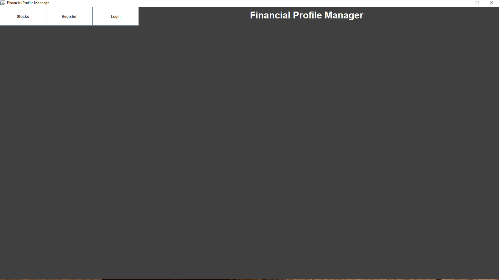 

*Here is the GUI and the main menu of the profile manager. Firstly, we will press the "Stock" button to view the menu of the tables for the Stock information.*

## Stock Menu:

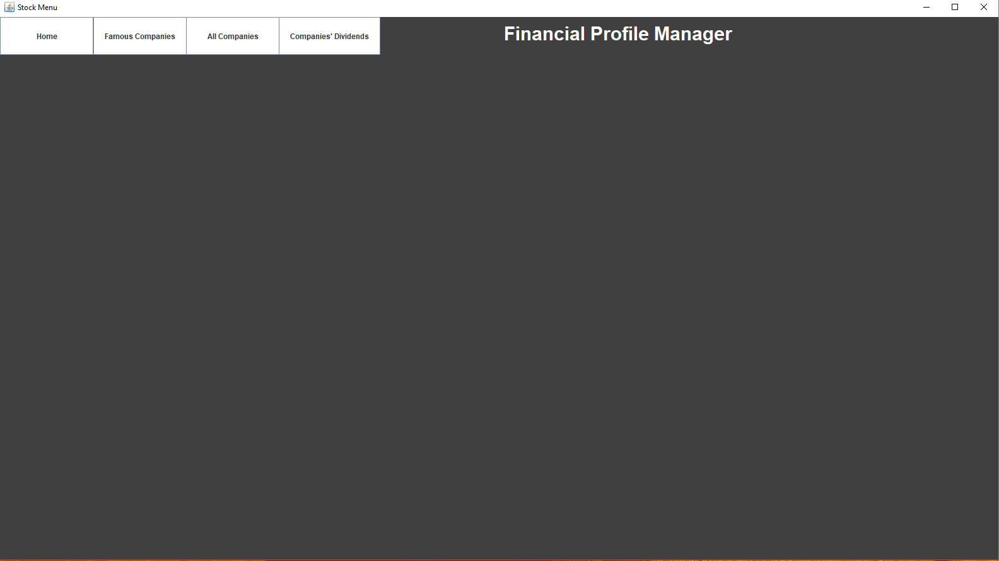 

*Here is the Stock menu, pressing "Famous companies" will take us to a table where you can view stock information for popular companies.*

## Stock Information:

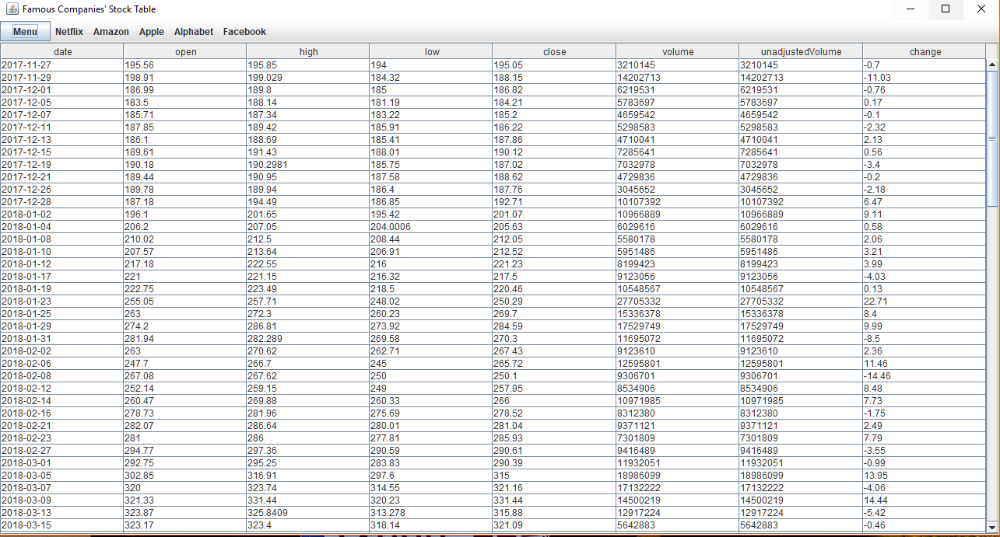

*Pressing "Menu" will take you back to the stock menu.*

 

*Secondly, by pressing "All Companies", a popup window will appear to choose a company's symbol which will result in a table of that company's stock information over the last five years.*

*Showing stock information for the Company "AAL" over the last five years.*
*Pressing "X" will close this window and return back to the Stock Menu.*
*Finally for the Stock Menu, pressing "Dividends" will display dividends information for a company of the user's choice.*

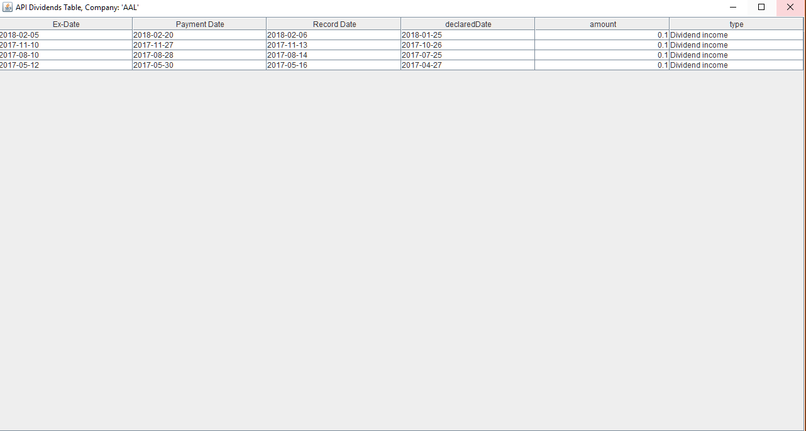

*Showing dividend information for the Company "AAL"*
*Pressing "X" will close this window and return back to the Stock Menu.* 
*Back on the Main Menu, we will now demonstrate how to register and log-in.*

## Register Section:

 

*We will now create a new account with a username "team4".

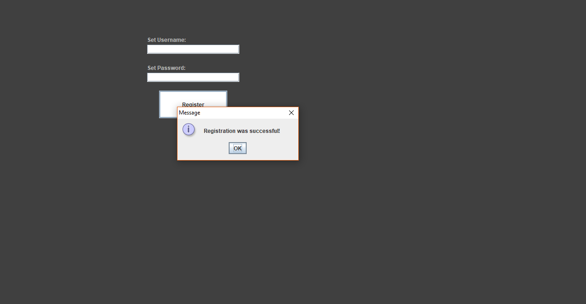 

*Registration was successful.*
*We will now log-in with the same account.*

## User Login:

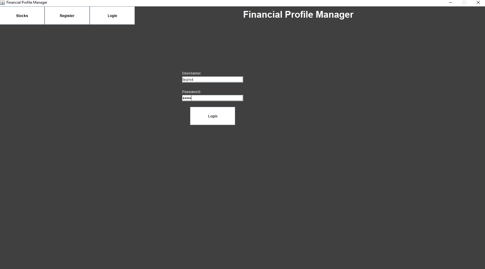 

*If the credentials are correct, this will take you to the user's portfolio menu.*

## User Portfolio:

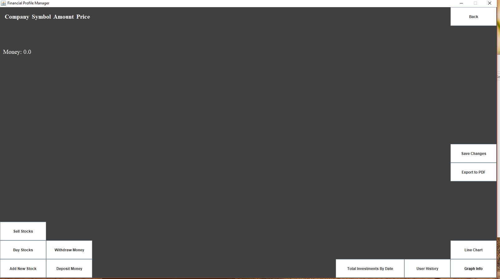 

*As this user is new, they do not owe any stocks. For demostration purposes we will log in with another existing account that owes stocks with same exact way.*

## User Portfolio (with stocks):

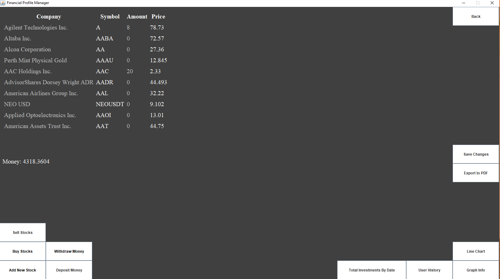 

*This is the Portfolio menu.*
*By pressing the "Save Changes" button, the user can confirm that all the changes have been saved and that they can safely log out.*
*The user can log out by pressing the "Back" button and then the "Log-out" button.*

## User Portfolio (Sold Stocks):

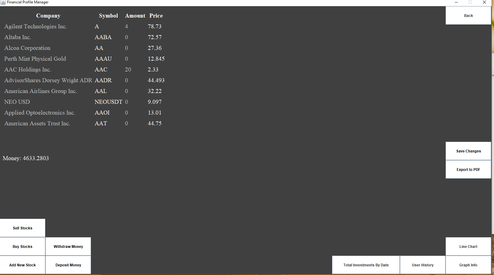 

*Sold 4 stocks from Agilent Technologies Inc., Money added.*

## User Portfolio (Buy Stocks):

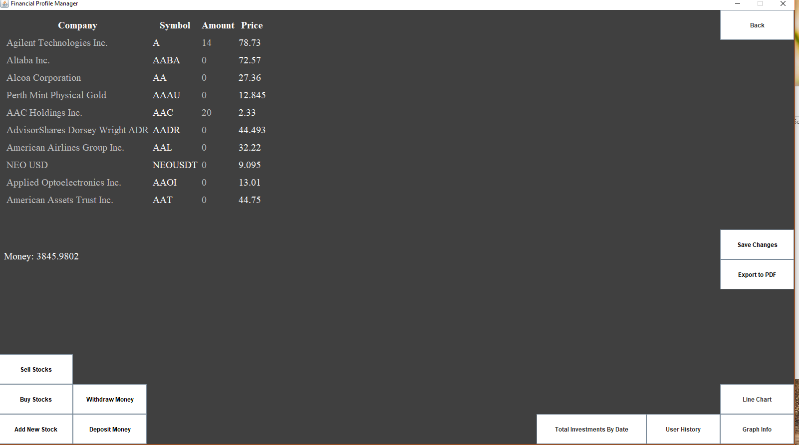 

*Bought 10 stocks from Agilent Techonlogies Inc., Money deducted.*

## User Portfolio (Add Stocks):

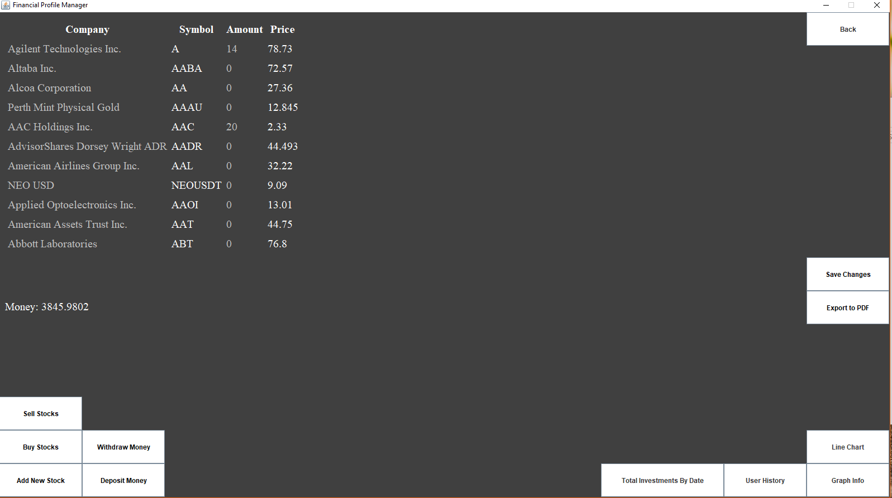

*Abbott Laboratories added.*

## User Portfolio (Withdraw Funds):

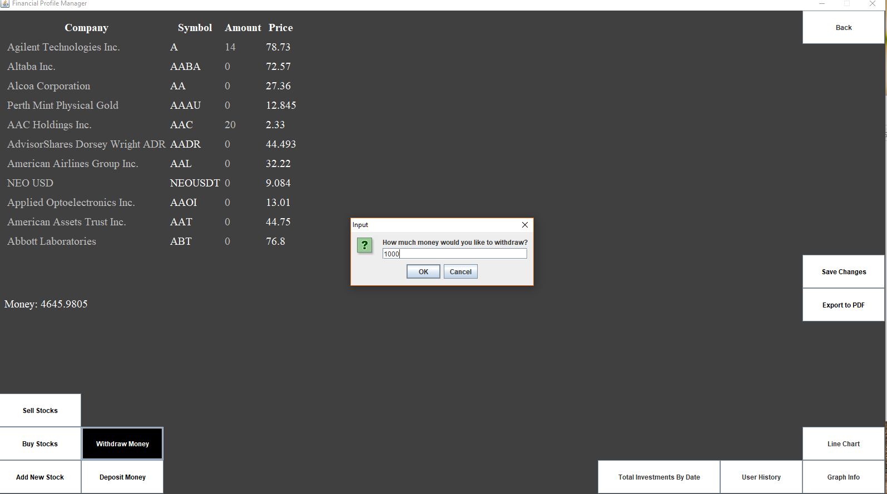 

*Withdrew $1000, money deducted.*

## User Portfolio (Deposit Funds):

 

*Deposited $800, money added.*

## User Investments (By Date):

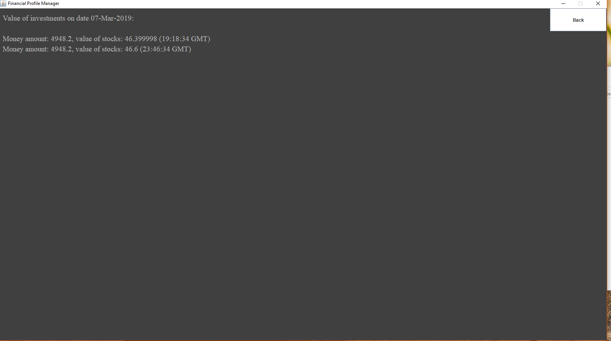 

*User's investments for a selected date.*
*Pressing "Back" will return back to the portfolio menu.*

## User Investments (Transaction History):

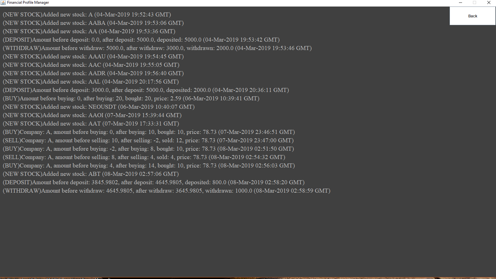 

*The history of transactions and stock additions of the user.*

## User Invesments (Bar Chart):

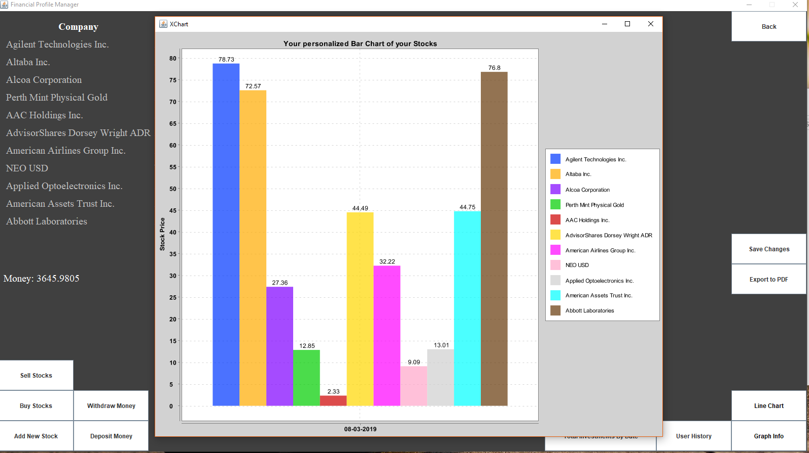

*The first graphical way to view and compare your personal stocks is a Bar chart. This can be achieved by pressing the "Graph Info" button.*
*User's owed stock prices in a bar chart, XChart Library was used for the creation of charts.*

## User Investments (Line Chart):

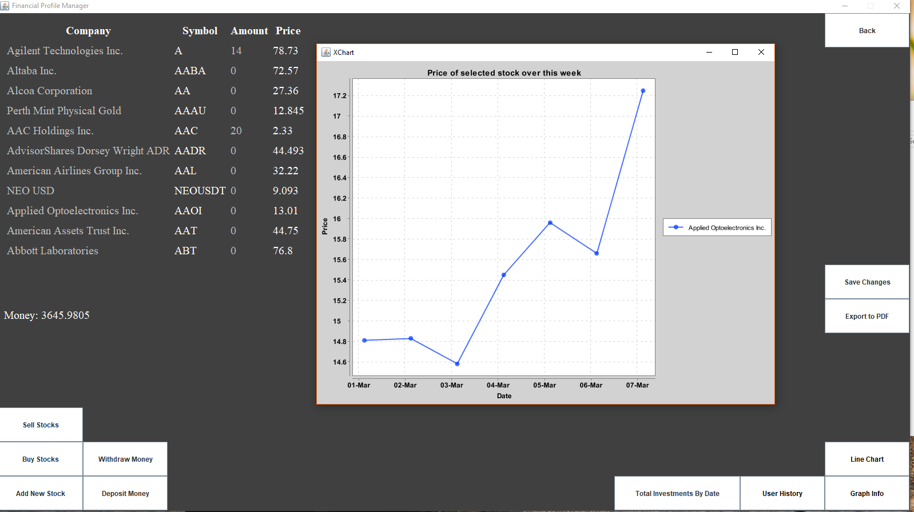

*The second graphical way to view and compare your personal stocks is a Line Chart which shows the open price of a single stock that the user owes over the last seven days.*
*This can be achieved by pressing the "Line Chart" button and choosing a Stock.*
*Showing the open price of the company "Applied Optoelectronics Inc." over the last seven days.*

## User Investments (Export to PDF):

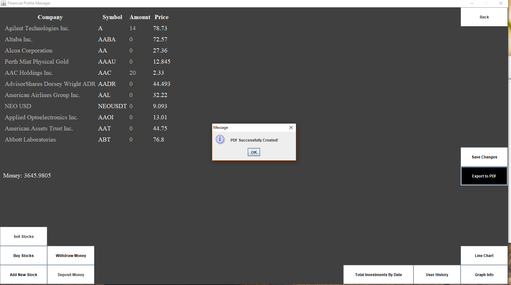
*You can also easily export all of your owed stocks prices and names in a PDF format using the "Export to PDF" button.*
*Successfully created the User's PDF, which can be found in the src folder.*

## User Investments (PDF File):

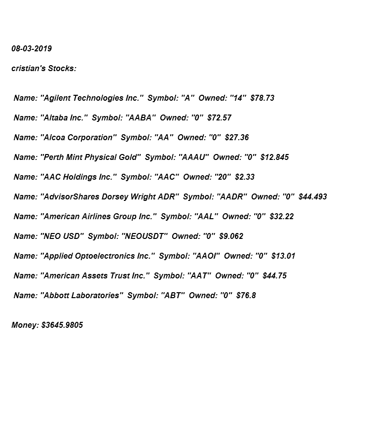
*A user's PDF File.*
