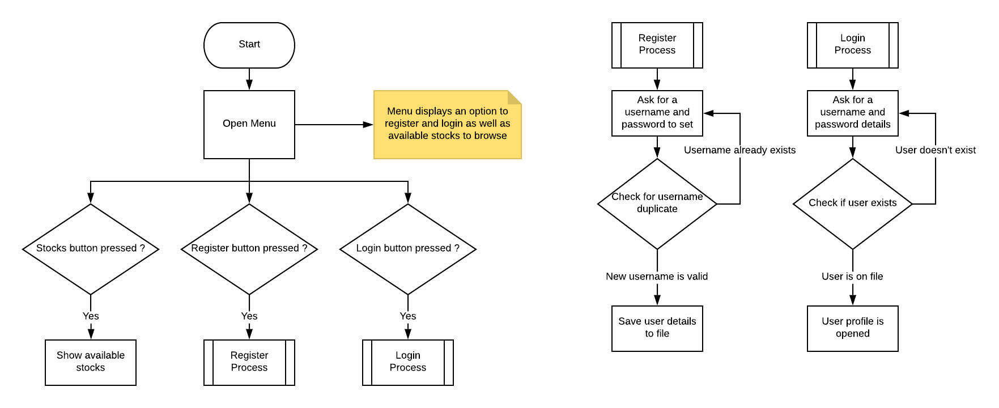
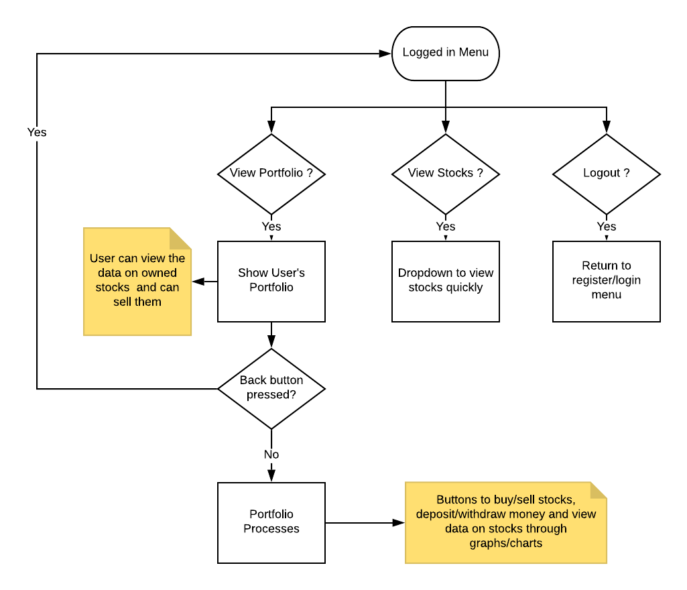
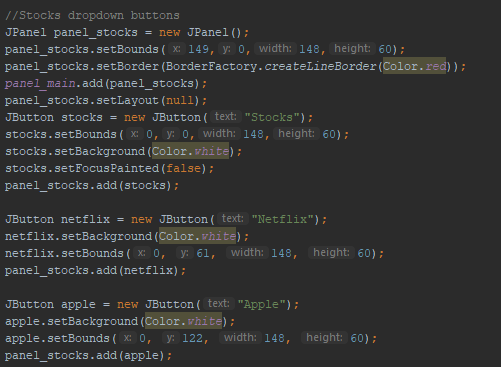
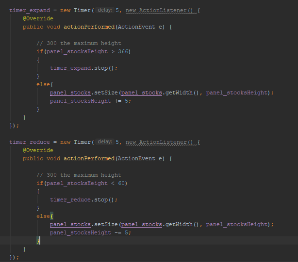
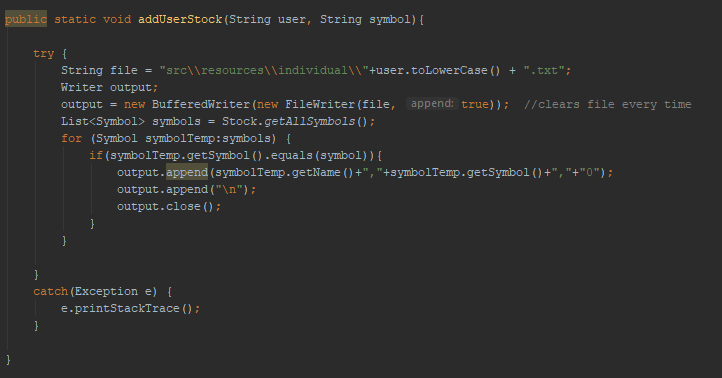
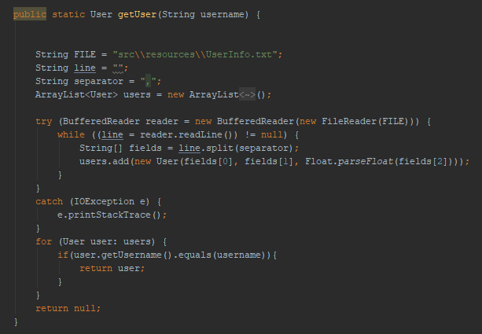
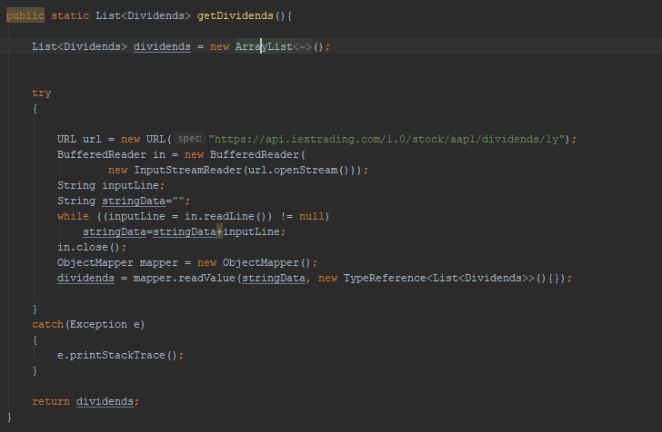

# Team Implementation Report

## Techical Diagrams

### Menu System Flowchart:
 

### Portfolio System Flowchart:
 

## Technical Description

### Menu:

*To design the menu, we used the built-in java swing API for the components we needed, such as JButton, JTextfield etc.*#
*We wanted to implement a dropdown to create an easy way for the user to view the stocks they have.*
*We implemented this dropdown using the ‘mouseListener’ so that the stocks could be viewed when the user hovered over the stocks tab.*
*This was done by using JButtons and implementing them in a dedicated panel. Two timers were needed to expand the visibility of the buttons in the panel and reduce the visibility.*
*We then added action listeners for each button to view the details of each stock.*

 

*The image above shows the panel for the stocks and 2 of the users’ stocks in the drop down.*

*The image below shows how we used the Timer class to expand and reduce the dropdown.*

*To expand the drop down we checked for the current height of the panel and created an if statement that said if it exceeded the maximum height of the stock’s buttons, stop the timer.*
*Otherwise continue to expand the height of the panel by 5 pixels until the maximum.*
*To reduce the timer, we did the exact opposite and subtracted 5 pixels until it reached the minimum height which was the stocks button.*

### Register/Login System:

*For the register and login system we used JTextfield and JButton as the method to retrieve the users input.*
*When the user registered a new account we took the information and stored it in an external file for record.*
*We did this using ‘buffered writer’ to write to the file and used an ArrayList to handle the data.*

*When the user would login we would check that the user exists on record for them to get into their profile.*
*We did this by using a for loop to iterate through the ArrayList of data and checking if each value equalled to what the user entered.*

### Drawing Graphs:

*We used a 3rd party library called ‘xchart’ to provide a more customizable and modern chart for our application.*
*The library allowed us to set a width and height for a graph as well as the subtitles needed to have a clear interface for the user.*
*We then entered the values retrieved as parameters for the bar graph and line graph.*

## Algorithms and Data Structures

### Algorithms:

*We have an algorithm to extract data from a website and put this data into a data structure for us to process later.*
*We used the BufferedReader to read the data and used the website as the input stream to read from. We then used java’s ‘ObjectMapper’ class to put the values into the ArrayList.*
*We surrounded this in a try/catch block as a means to prevent the program from crashing if an error occurred.*

### Data Structure:

*We used the ‘ArrayList’ data structure as a way to hold the data values retrieved by the website.*
*This allowed us to organize and then put the specific values we wanted into the right graphs for the users viewing.*
*The time complexity of an ‘ArrayList’ is O(1) which means it will take a constant amount of time to complete an operation no matter the amount of data in the set.*
*Some operations of the ‘ArrayList’ for example ‘remove()’ have a time complexity of O(n) which means it runs on linear time and it depends on how much data is in the set.*

## Imported Libraries 

*XChart is a library used for plotting data. We used this to create our bar charts and line graphs.*

## Known Issues

*There aren’t many issues we can see with our product however, there is definitely room for improvement.*
*If numerous users registered onto our portfolio manager then the login process would take longer.*
*The more users stored on the system with unique information about their portfolios, the longer it would take for the system to search through the different users.*
*This would make the program run slower and since we use a CSV file to store user’s login information, it would impact the speed of the program negatively in a more drastic way than if we were using a database.*
*So changing the way we store data from a CSV file to a database would help prevent the system from running slower.*
