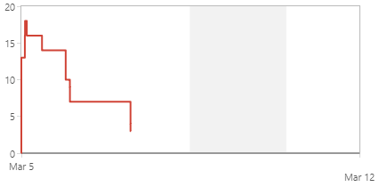

# Project Management Log

## Project management discussion

*For the final product, the team got together during the weekdays, in order to finish the product so that it could be submitted for the deadline.*
*The team worked well during these final weeks, especially towards the end when it was realized that some goals would not be achieved due to time constraints etc.*
*Furthermore, on the programming side, it was decided that some desirable features would be included in order to fully achieve the user stories, that were in the backlog.*

*We held scrum meetings every 2 weeks during the final sprints for the product, these were mainly 'sprint planning' sessions, where we decided what we would focus on.*
*We largely missed doing the retrospective meetings due to time constraints, although some time was spent reflecting on what still needed to be achieved in the final product.*

*There were some minor communication issues that did affect the final product, this was mainly to do with the markdown files, and who had responsibility for which files.*
*Furthermore, for the product testing markdown file, the programmers of the final product had to communicate the structure of the code to the analysts so that it was fully understood.*
*There was also some minor problems in regard to adding features to the final product, as different developers had differing priorities for what was to be added to the product.*

*Standup meetings were held every 2 weeks as detailed above, however they were not recorded on JIRA and therefore can't be linked in this document.*
*However, during these standup meetings, the main point of focus was to prioritize additional features that were to be added to the final product.*
*We also had to demonstrate our product to our project supervisor during this meeting, so that progress could be recorded for each weeks lab.*

## Sprint Burndown Charts

 
*Sprint 6*

 
*Sprint 7*

 
*Sprint 8*

 
*Sprint 9*

 
*Sprint 10*

## Burndown-Charts Discussion

*From the sprint burndown charts, it can be shown that although the cards had weights correctly assigned to them, many cards were created mid sprint, and then carried over to the next.*
*This meant that from the charts, a steady decrease in the chart was not shown, and instead there was more of a steady line, even though cards were completed sequentially by the team.*
*In turn, this shows that more tasks should have been identified during the sprint planning sessions. This lesson can be directly applied to the individual project, where JIRA may be used again.*

## Product Backlog

 

## Other Areas
*Other JIRA functions were used, such as an epic, and various user stories (backlog), risks (backlog), and bugs.*
